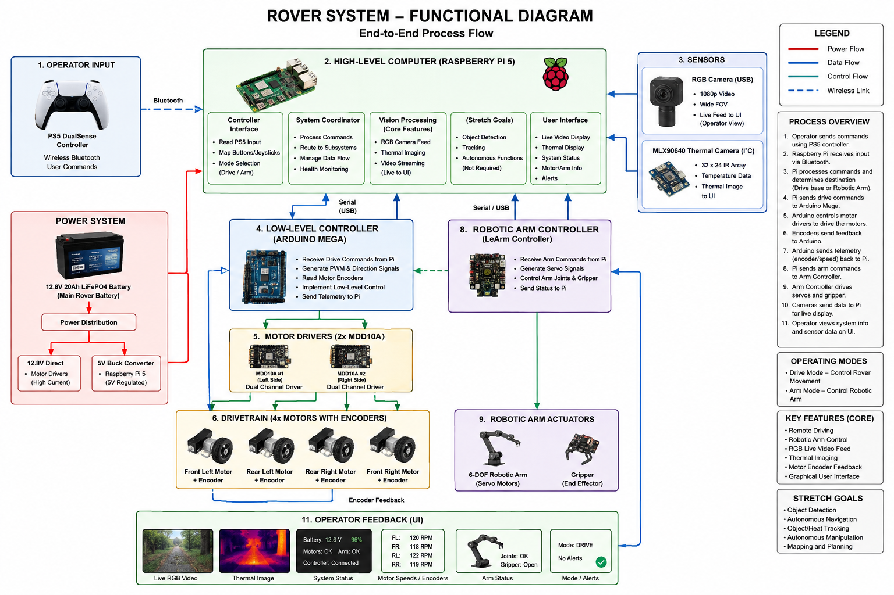

# Multi-Sensor Robotic Rover with Robotic Arm

## Project Overview

This project focuses on the design and development of a remotely operated robotic rover capable of environmental observation, thermal imaging, object detection, and robotic manipulation. The system combines a custom 3D-printed mobile rover platform with a multi-axis robotic arm, Raspberry Pi computer, Arduino microcontroller, RGB camera, thermal camera, and wireless game controller.

The primary goal of the project is to create a complete remotely controlled robotic system rather than a collection of independent components. A Raspberry Pi 5 will act as the rover's high-level computer and coordinate user input, camera systems, the graphical user interface, and communication with the rover and robotic arm controllers.

An Arduino Mega will act as the rover's low-level motor controller. It will receive movement commands from the Raspberry Pi and control four DC gearmotors through dual-channel motor drivers. Integrated motor encoders will provide wheel rotation and speed feedback.

A six-degree-of-freedom robotic arm will be mounted on top of the rover and controlled through its own controller. The Raspberry Pi will communicate with the arm controller, allowing the same control system used to drive the rover to also operate the robotic arm.

The rover will additionally contain both a standard RGB camera and a thermal imaging sensor. The RGB camera will provide a live video feed to the operator and may be used for object detection, while the thermal camera will provide a thermal image for locating and observing heat sources.

The primary operating mode of the rover will be remote control (RC) using a PlayStation 5 DualSense controller. Autonomous navigation may be investigated as a stretch goal after all primary functionality has been completed.

---

## Project Objectives

The primary objectives of the project are to:

- Design and manufacture a custom 3D-printed rover chassis.
- Implement a four-wheel electric drivetrain.
- Control the drivetrain using an Arduino Mega and motor drivers.
- Use wheel encoders to monitor motor/wheel movement.
- Integrate a Raspberry Pi 5 as the rover's central high-level computer.
- Connect a PS5 DualSense controller to the Raspberry Pi using Bluetooth.
- Allow the operator to remotely drive the rover.
- Integrate a six-degree-of-freedom robotic arm.
- Allow the operator to control both the rover and robotic arm.
- Provide a live RGB camera feed.
- Capture and display thermal imagery.
- Develop a graphical user interface for monitoring and controlling the rover.
- Implement object detection using the RGB camera.
- Create a modular architecture that allows individual subsystems to be tested independently.

Autonomous navigation and autonomous object interaction are considered stretch goals and are not required for the initial functional system.

---

# System Architecture

The rover uses a distributed control architecture consisting primarily of a Raspberry Pi 5, Arduino Mega, and the robotic arm's dedicated controller.

The Raspberry Pi performs high-level computing tasks while the Arduino performs low-level drivetrain control.

Conceptually, the system is organized as follows:

                         PS5 DualSense
                               |
                           Bluetooth
                               |
                               v
                     +-------------------+
                     |   Raspberry Pi 5  |
                     |                   |
                     | - User Interface  |
                     | - Controller Input|
                     | - RGB Video       |
                     | - Thermal Imaging |
                     | - Object Detection|
                     | - System Control  |
                     +---------+---------+
                               |
                    +----------+----------+
                    |                     |
                 Serial/USB            Serial/USB
                    |                     |
                    v                     v
             +-------------+       +--------------+
             | Arduino Mega|       | LeArm        |
             |             |       | Controller   |
             +------+------+       +------+-------+
                    |                     |
                 PWM/DIR               Servos
                    |                     |
             +------+------+              v
             |             |        Robotic Arm
             v             v
          MDD10A         MDD10A
          Driver #1      Driver #2
           |    |         |    |
           v    v         v    v
          M1    M2       M3    M4
           |    |         |    |
        Encoder Encoder Encoder Encoder

The Raspberry Pi therefore acts as the central coordinator of the system, while dedicated controllers handle hardware-specific operations.

---

# Raspberry Pi 5

A Raspberry Pi 5 with 4 GB of RAM serves as the rover's primary computer.

The Raspberry Pi is responsible for:

- Connecting to the PS5 DualSense controller over Bluetooth.
- Reading joystick, trigger, and button inputs.
- Translating controller inputs into rover and robotic arm commands.
- Communicating with the Arduino Mega.
- Communicating with the robotic arm controller.
- Receiving the RGB camera feed.
- Receiving thermal sensor data.
- Generating the thermal image.
- Running object-detection software.
- Running the rover's user interface.
- Coordinating the major rover subsystems.

The Raspberry Pi is intentionally separated from direct motor control. This allows computationally intensive tasks such as computer vision and graphical interface processing to run independently of the timing-sensitive motor-control system.

---

# Arduino Mega

An Arduino Mega is used as the low-level drivetrain controller.

The Arduino receives movement commands from the Raspberry Pi and converts those commands into the signals required by the motor drivers.

Its responsibilities include:

- Receiving drive commands from the Raspberry Pi.
- Generating PWM motor-speed signals.
- Controlling motor direction.
- Reading the four motor encoders.
- Monitoring individual wheel speeds.
- Providing drivetrain information back to the Raspberry Pi.
- Implementing low-level motor-control logic.

Using an Arduino for these tasks prevents motor timing and encoder processing from being affected by other processes running on the Raspberry Pi.

---

# Rover Drivetrain

The rover uses four independently driven DC gearmotors.

Each motor assembly contains:

- 12 V DC gearmotor
- Wheel
- Quadrature/magnetic encoder
- Motor mounting hardware

Two dual-channel Cytron MDD10A motor drivers are used to operate the four motors.

Each MDD10A controls two motors:

- MDD10A #1
  - Front Left Motor
  - Rear Left Motor

- MDD10A #2
  - Front Right Motor
  - Rear Right Motor

The Arduino Mega sends direction and PWM commands to the motor drivers.

The encoders provide feedback that can be used to calculate:

- Wheel speed
- Motor RPM
- Distance traveled
- Relative wheel movement

Encoder feedback may also be used to improve straight-line driving and compensate for differences between individual motors.

---

# Robotic Arm

A six-degree-of-freedom LeArm robotic arm will be mounted on the upper portion of the rover.

The arm includes multiple servo motors and a gripper, allowing the rover to physically interact with objects in its environment.

The arm will initially be tested as an independent subsystem using its supplied controller and power adapter.

Once basic arm functionality has been verified, the Raspberry Pi will communicate with the arm controller so that arm commands can be generated from the rover's main control system.

Potential controller mappings may allow the PS5 controller to switch between:

1. Rover driving controls
2. Robotic arm controls

This allows a single wireless controller to operate the entire robotic platform.

The arm is being treated as a modular subsystem. This allows it to be removed from the rover and operated independently if desired.

A portable battery solution for the robotic arm may be implemented during final system integration.

---

# RGB Camera

A USB UVC-compatible 1080p camera will provide the rover's primary visual feed.

Current camera specifications include:

- 1920 × 1080 resolution
- Up to 30 FPS
- USB 2.0
- UVC compatibility
- MJPEG support
- Wide-angle lens
- Approximately 103-degree horizontal field of view

Because the camera uses the standard USB Video Class protocol, it can interface directly with the Raspberry Pi without requiring a proprietary camera controller.

The RGB camera will have two primary purposes:

### Operator Video

The live camera feed will be displayed in the rover's user interface so that the operator can see from the rover's perspective while controlling it remotely.

### Object Detection

Frames from the RGB camera may also be processed by computer-vision software running on the Raspberry Pi.

The system may identify selected objects and display detection information over the camera feed.

Object detection does not require the rover to autonomously navigate toward detected objects. The information can simply be presented to the human operator.

---

# Thermal Imaging

An MLX90640 thermal camera will provide thermal sensing capability.

The MLX90640 contains a 32 × 24 infrared sensor array, producing 768 individual temperature measurements per frame.

The Raspberry Pi will read the thermal data and convert it into a visual heat map.

The thermal system will allow the operator to:

- Observe temperature differences in the environment.
- Identify heat sources.
- Determine the approximate location of warmer objects.
- View thermal information through the rover UI.

The goal of this subsystem is not to produce high-resolution professional thermal photography. Instead, it provides the rover with an additional sensing capability that allows heat sources to be identified and monitored.

---

# Remote Control System

The primary operating mode of the rover will be remote control.

A PlayStation 5 DualSense controller will connect wirelessly to the Raspberry Pi using Bluetooth.

A possible controller layout could include:

- Left stick — Forward/reverse movement
- Right stick — Steering
- Triggers — Speed control or additional functions
- Buttons — Switch between rover and arm control
- D-pad — Robotic arm movement
- Shoulder buttons — Gripper control
- Options/Create buttons — Mode or UI functions

The exact controller mapping will be determined during software development.

The Raspberry Pi interprets the controller input and determines whether commands should be sent to the drivetrain Arduino or robotic arm controller.

---

# User Interface

A graphical user interface will provide the operator with a centralized view of the rover.

The interface may display:

- RGB camera feed
- Thermal image
- Object-detection results
- Rover connection status
- Controller connection status
- Motor speeds
- Encoder information
- Robotic arm status
- System operating mode
- Battery information, if battery monitoring is later implemented

A conceptual interface could resemble:

+-----------------------------------------------------+
|                    ROVER CONTROL                    |
+--------------------------+--------------------------+
|                          |                          |
|       RGB CAMERA         |      THERMAL IMAGE       |
|                          |                          |
|      Live 1080p Feed     |        Heat Map          |
|                          |                          |
+--------------------------+--------------------------+
| Controller: Connected                               |
| Rover: Ready                                        |
| Arm: Ready                                          |
|                                                     |
| FL: -- RPM       FR: -- RPM                         |
| RL: -- RPM       RR: -- RPM                         |
+-----------------------------------------------------+

The final interface design will evolve as the individual subsystems are implemented.

---

# Power System

The rover drivetrain and computing electronics will primarily operate from a 12.8 V LiFePO4 battery.

Current battery specifications:

- 12.8 V nominal voltage
- 20 Ah capacity
- 256 Wh energy capacity
- 20 A BMS
- 20 A maximum continuous discharge
- Approximately 3.3 lb

The 12.8 V supply can be delivered directly to the motor drivers for the 12 V drivetrain.

A DC-DC buck converter will convert the battery voltage to approximately 5 V for the Raspberry Pi.

Conceptually:

                    12.8V LiFePO4
                           |
                    Power Protection
                           |
                    Power Distribution
                      /          \
                     /            \
                 12.8V             5V
                   |                |
             Motor Drivers      Buck Converter
                   |                |
               4 Motors        Raspberry Pi

The final power system will include appropriate wiring, connectors, fusing, power distribution, and a master power switch.

These components will be finalized after the major hardware has been physically assembled so that wire lengths, current requirements, connector types, and mounting locations can be determined accurately.

The robotic arm will initially use its supplied external power adapter during development. A separate portable battery solution may later be implemented so that the arm can operate while the rover is mobile.

---

# Mechanical Design

The rover chassis will be custom designed and 3D printed.

The chassis must support:

- Four motors
- Four wheels
- Main battery
- Raspberry Pi
- Arduino Mega
- Two motor drivers
- RGB camera
- Thermal camera
- Robotic arm
- Wiring and power electronics

Because the robotic arm is mounted above the chassis, center of gravity will be an important mechanical consideration.

Heavy components such as the main LiFePO4 battery should therefore be positioned as low as practical in the chassis.

The chassis will also need sufficient structural reinforcement around the robotic arm mounting point because movement of the arm can generate forces and moments on the rover body.

The modular design should allow major components to be removed for testing, repair, or replacement.

---

# Communication Architecture

The system uses multiple communication methods depending on the subsystem.

| Connection | Interface |
|---|---|
| PS5 Controller → Raspberry Pi | Bluetooth |
| RGB Camera → Raspberry Pi | USB/UVC |
| MLX90640 → Raspberry Pi | I2C |
| Raspberry Pi → Arduino Mega | USB Serial / UART |
| Arduino → Motor Drivers | PWM / Digital |
| Motor Encoders → Arduino | Digital Encoder Signals |
| Raspberry Pi → LeArm Controller | Serial / USB |

This architecture allows each controller to perform the tasks for which it is best suited.

---

# Software Architecture

The software will be divided into multiple modules rather than implemented as one large program.

Possible modules include:

rover/
|
+-- raspberry_pi/
|   |
|   +-- controller/
|   |   +-- ps5_controller.py
|   |
|   +-- vision/
|   |   +-- rgb_camera.py
|   |   +-- object_detection.py
|   |   +-- thermal_camera.py
|   |
|   +-- communication/
|   |   +-- arduino_serial.py
|   |   +-- arm_serial.py
|   |
|   +-- ui/
|       +-- rover_ui.py
|
+-- arduino/
|   |
|   +-- rover_controller/
|       +-- rover_controller.ino
|
+-- documentation/
|
+-- cad/
|
+-- README.md

The exact structure may change as development progresses.

---

# Development Plan

Development will be performed incrementally so that each subsystem can be tested independently before full integration.

## Phase 1 - Drivetrain

- Assemble motors and wheels.
- Connect motor drivers.
- Connect Arduino Mega.
- Test individual motors.
- Implement forward/reverse control.
- Implement steering.
- Read encoder signals.
- Test four-wheel drivetrain.

## Phase 2 - Raspberry Pi

- Configure Raspberry Pi OS.
- Configure Bluetooth.
- Establish Pi-to-Arduino communication.
- Develop basic command protocol.

## Phase 3 - Remote Control

- Pair PS5 controller.
- Read controller inputs.
- Translate joystick positions into movement commands.
- Send commands from Pi to Arduino.
- Remotely drive rover.

At this stage, the project's core RC functionality should be operational.

## Phase 4 - RGB Camera

- Connect USB camera.
- Capture video.
- Stream video to rover UI.
- Test latency and frame rate.

## Phase 5 - Thermal Camera

- Connect MLX90640.
- Read thermal array.
- Generate thermal heat map.
- Display thermal image in UI.

## Phase 6 - Robotic Arm

- Assemble/test LeArm independently.
- Verify servo and gripper operation.
- Establish communication with Raspberry Pi.
- Develop PS5 arm controls.
- Mount arm to rover.

## Phase 7 - User Interface

Integrate:

- RGB video
- Thermal image
- Rover status
- Motor information
- Arm status
- Controller status

into a single operator interface.

## Phase 8 - Object Detection

- Configure computer-vision environment.
- Process RGB camera frames.
- Detect selected objects.
- Display detection results in the UI.
- Optimize performance for Raspberry Pi 5.

## Phase 9 - Final Integration

- Finalize chassis.
- Finalize power distribution.
- Install fuse and master switch.
- Secure wiring.
- Mount cameras.
- Mount arm.
- Perform full-system testing.
- Measure runtime and operating temperatures.
- Test rover under expected loads.

---

# Core Project Requirements

For the project to be considered functionally complete, the system should be capable of:

- Remote movement using a PS5 controller.
- Four-wheel motor control.
- Encoder feedback.
- Raspberry Pi-to-Arduino communication.
- Robotic arm operation.
- RGB live video.
- Thermal imaging.
- User-interface display.
- Integrated operation of the major subsystems.

---

# Stretch Goals

The following features may be investigated after the primary system is fully functional:

- Autonomous navigation
- Autonomous obstacle avoidance
- Autonomous heat-source tracking
- Autonomous object tracking
- Automatic arm positioning
- RGB/thermal image fusion
- Mapping
- Additional environmental sensors
- Battery voltage/current monitoring

These features are intentionally treated as extensions rather than requirements so that development can prioritize a reliable RC rover first.

---

# Project Philosophy

The primary design goal is modularity.

Rather than having one controller perform every task, the system distributes responsibilities between specialized subsystems:

- **Raspberry Pi 5:** high-level control, UI, vision, Bluetooth, and coordination
- **Arduino Mega:** real-time drivetrain and encoder control
- **LeArm Controller:** robotic arm and servo control
- **RGB Camera:** visual information and object detection
- **MLX90640:** thermal information
- **PS5 Controller:** human input

This architecture allows each subsystem to be developed and tested independently before being integrated into the complete rover.

The final result will be a mobile robotic platform capable of remote operation, visual and thermal observation, object detection, and physical manipulation through a robotic arm.

## Functional Diagram

The following diagram shows the overall functional architecture of the rover system.

